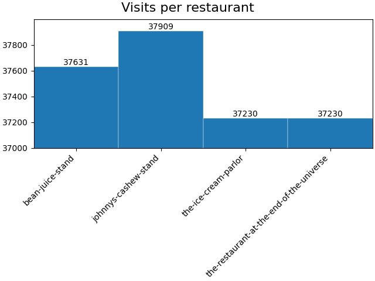
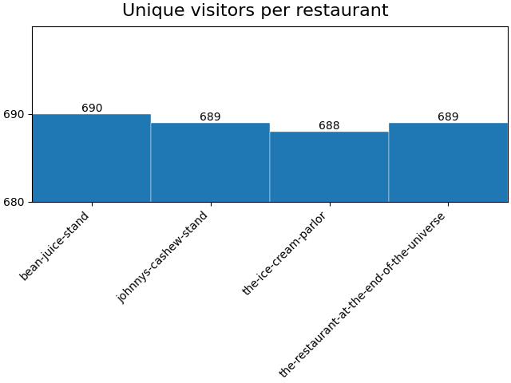
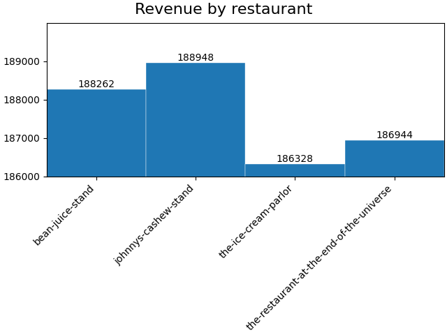
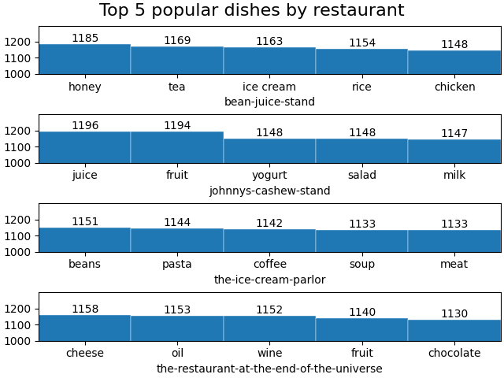
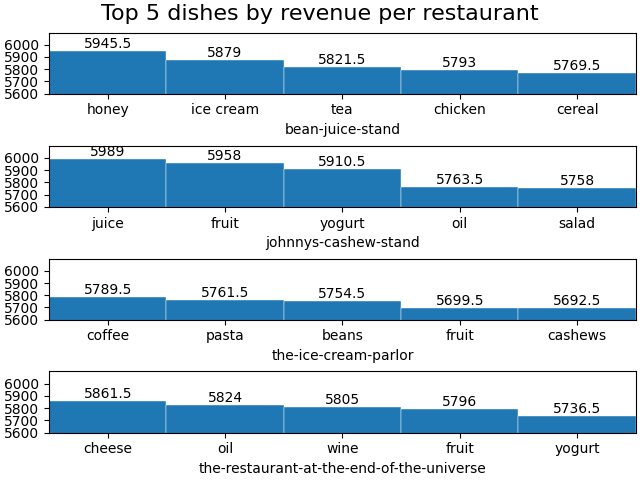
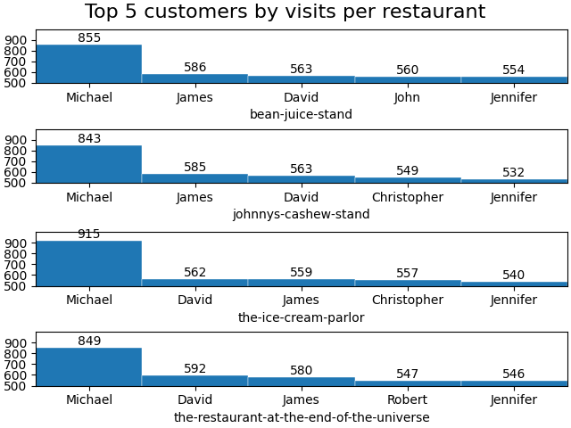
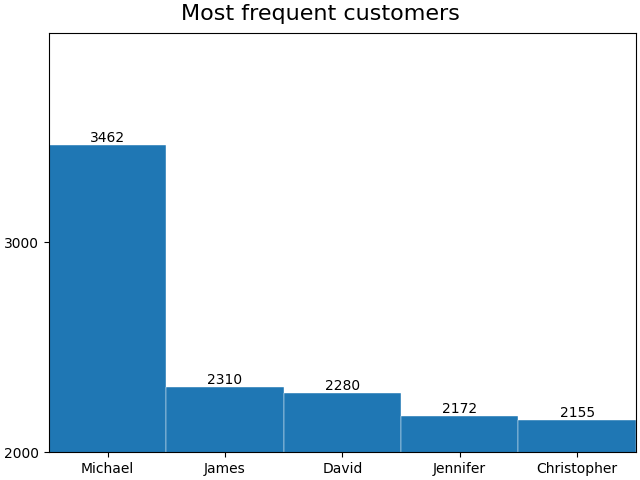

# Solution

## Instructions to reproduce answers

1. You may use a virtual environment with the `pipenv shell` command.
2. First, run the `load_data.py` script to load the csv file into a sqlite database.
3. Then, you can run each of `plot_1.py` to `plot_5.py` to recreate the plots in `plots/`

## Responses to questions

### How many customers visited the "Restaurant at the end of the universe"?

Answer: The Restaurant at the end of the universe had 37230 visits. The visits were from 689 unique visitors.

### How much money did the "Restaurant at the end of the universe" make?

Answer: The Restaurant at the end of the universe made 186944 in revenue.

### What was the most popular dish at each restaurant?

Answer: The most popular dish at each restaurant is summarized in the table below.

| Restaurant                   | Most Popular Dish | Orders |
|------------------------------|-------------------|--------|
| Bean Juice Stand             | Honey             | 1185   |
| Johnny's Cashew              | Juice             | 1196   |
| The Ice Cream Parlor         | Beans             | 1151   |
| The Restaurant at the End... | Cheese            | 1158   |

### What was the most profitable dish at each restaurant?
Answer: The dish that brought in the most revenue at each restaurant is summarized in the table below.

| Restaurant                   | Top Revenue Dish | Orders |
|------------------------------|------------------|--------|
| Bean Juice Stand             | Honey            | 5945.5 |
| Johnny's Cashew              | Juice            | 5989.0 |
| The Ice Cream Parlor         | Coffee           | 5789.5 |
| The Restaurant at the End... | Cheese           | 5861.5 |

### Who visited each store the most, and who visited the most stores?

Answer: 

| Restaurant                   | Most Frequent Customer | Visits |
|------------------------------|------------------------|--------|
| Bean Juice Stand             | Michael                | 855    |
| Johnny's Cashew              | Michael                | 843    |
| The Ice Cream Parlor         | Michael                | 915    |
| The Restaurant at the End... | Michael                | 849    |

Answer: Michael made the most visits to stores with a total of 3462 visits.

### How would you build this differently if the data was being streamed from Kafka?

Answer: I would avoid using Kafka, because Kafka introduces complexity and I do not think there is a use case for
streaming or real-time updates. For a restaurant group, I'm guessing half a day of incomplete data isn't very 
actionable.

If Kafka is needed for scale, then I would find where other potential scaling bottlenecks might be
by instrumenting the system. For example, I might need to optimize the database queries.

As an alternative, the above charts can be produced and updated on-demand or in daily batch jobs, instead of streaming.

If I were to need a streaming application, I would build it by use existing, mature streaming platforms for storage,
query, and dashboards, including managed services. As an example, you could white-label and embed a Tableau or PowerBI 
dashboard connected to a MySql backend, updated by an input stream. Then use that beta version to figure out what's
useful before building out the product.

### How would you improve the deployment of this system?

Answer: I used `sqlite` for the database, `matplotlib` for plotting, and markdown files in GitHub for hosting the
"dashboard". To deploy this in production, I would need to set up a persistent database. To update the plots, I can set
up a periodic cron script to run the plotting scripts and overwrite the static images. Adding to this "dashboard" is
accomplished by updating this file and adding plotting scripts to git. A more flexible and expandable system is 
certainly possible, depending on requirements.